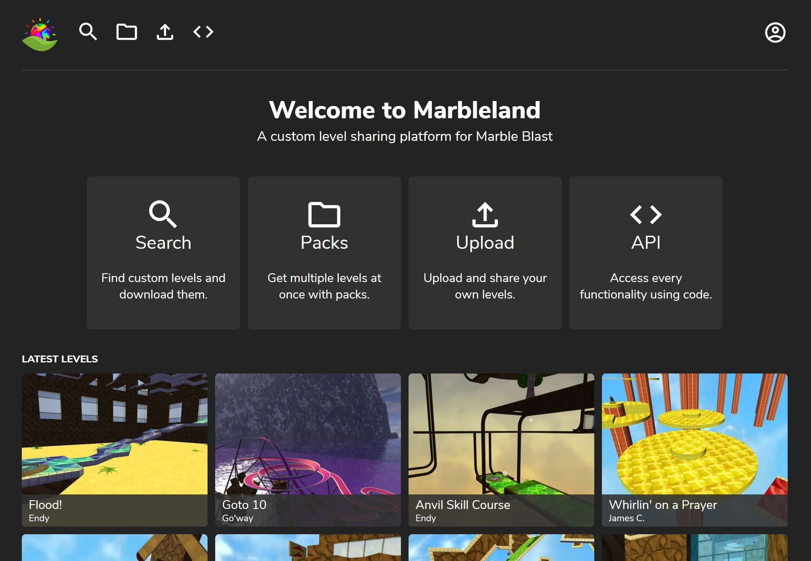

# Marbleland
A custom level sharing platform for Marble Blast, allowing you to browse, download and upload custom levels and level packs. https://marbleland.vani.ga/

[View version history](version_history.md)

## About
Custom levels have always been a central part of all Marble Blast games, but things haven't always been easy:

- Custom levels are all over the place and are therefore hard to find
- There's no standard place to post your own customs, so they're usually posted on forum threads
- People format their custom levels differently, making them more difficult to install than they need to be

Marbleland tries to solve these issues by being a central hub for all custom levels. Levels can easily be searched for, filtered and downloaded, and user-compiled custom level packs make it easy to download multiple, related levels at once. Everyone with an account can also upload their own levels to the platform and share them. All custom levels downloaded from Marbleland are automatically normalized into a standard folder structure, which makes installing them as simple as just merging the level folder with your Marble Blast data directory.

## API
Marbleland also provides a RESTful API for full programmatic interfacing with its features.

Check out the docs [here.](docs/api.md)

## Implementation
Marbleland's frontend was built using Vue.js and its backend using Node. When custom levels are imported/uploaded, an asset dependency tree is constructed by scanning the .mis file for the required files, and then scanning those files for their dependencies. This way, all assets needed to correctly run the custom level can be identified and included in the .zip. Marbleland currently identifies the mission file and thumbnails, interiors, interior textures, sky materials, TSStatic shapes, shape materials and music as level dependencies. .mis and .dts file parsing is done using the parsers used in the [webport](https://github.com/Vanilagy/MarbleBlast), and .dif parsing uses RandomityGuy's [hxDif](https://github.com/RandomityGuy/hxDIF) library.

## Building and developing
This project requires Node.js v14.0.0 and above to run. After cloning, simply run `npm install` in the cloned directory to install all required dependencies. Then run `npm run watch` to create the necessary JavaScript bundles and to watch for future file changes. Run `npm run build` to create minified bundles.

Marbleland requires a PQ data directory for default asset lookup. This directory isn't included in the repo, so you'll have to download it. You can get it [here](https://drive.google.com/file/d/14IocHL5g7t0Bf1Iyu1ExKvyKvReLlE7E/view?usp=sharing) or by cloning [PlatinumQuest](https://github.com/PlatinumTeam/PlatinumQuest). Once downloaded, you'll need to tell Marbleland where it is by setting `dataPQ` in `server/data/config.json` to the correct path.

Running `npm start` starts the HTTP server on the port defined in `server/data/config.json` (8080 by default).

Marbleland offers a few CLI commands:

- `npm run add-directory -- <directory-path> [--id-map <id-map-path>] [--replace-duplicates]` 
Imports a directory of custom levels into the database. Will import all .mis files in `<directory-path>`.  
The ID map, when specified, has to point to a JSON file that contains an array of `{id: number, baseName: string}` objects. Imported missions whose base name (file name of the .mis file without path) matches a base name in the array will automatically get their ID set to the one specified by the ID map.  
When the `--replace-duplicates` option is set, duplicate levels already present in the database will be replaced by the freshly imported ones. If it isn't set, the level will be in the database twice. Replaced levels will maintain stats like download count. This option is usually recommended.

- `npm run reimport -- [--allow-creation] [level_id ...]` 
Will go over all imported levels and reimport them (rebuilding the dependency tree and so on). A list of level IDs can be passed as an optional argument. When present, instead of reimporting all levels, only the levels with the specified IDs will be reimported. When the `--allow-creation` option is set, this command will also be able to import new missions it finds in the directories (instead of just updating old ones).